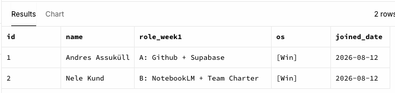
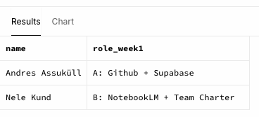

# Team Members - Week 0

---

## **Eesmärk** 

Luua SQL-i abil tabel, lisada sinna andmeid lisada ja kuvada sisu.

## **Tehtud töö**

- Loodud tabel `team_members`.
- Lisatud meekonnaliikmed: nimi, roll ja kursuse nädal.
- Kuvati salvestatud andmed käsuga `SELECT`.
- Selekteeri liikmed nime ja rolli järgi käsuga `ORDER`.

## **Tulemus**
\- Team Members tabeli kuvamine.  

\- Selekteerimine Team Members tabelis.  

