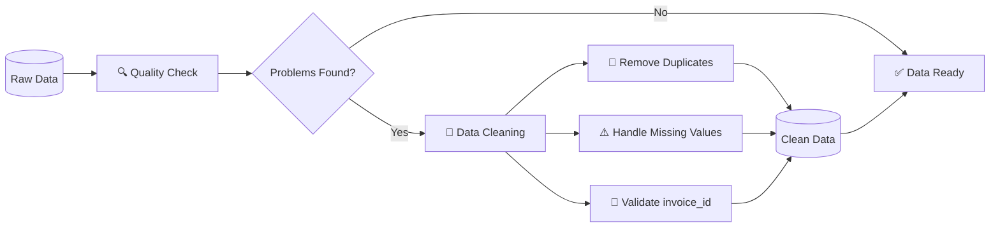

# Nädal 2: SQL Cleaning

> ***Iseseisev töö, kus otsiti puuduvad ja korduvaid andmeid ning uuriti andmeformaate ja tüübikonversioone.***

---

### 🔄 Andmete puhastamise protsess

---

### 🔍 OSA 1. Duplikaadid ja nende tuvastamine

---

### ⚠️ OSA 2. NULL väärtused

---

### 🔄 OSA 3. Andmeformaadid ja tüübikonversioonid
