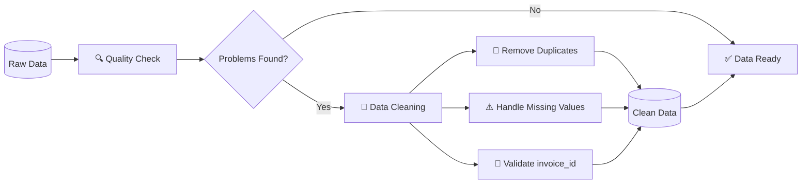

# Nädal 2: SQL Cleaning

> ***Iseseisev töö, kus otsiti puuduvad ja korduvaid andmeid ning uuriti andmeformaate ja tüübikonversioone müügiandmetes.***

---

### 🔄 Andmete puhastamise protsess

---

### 🔍 OSA 1. Duplikaadid ja nende tuvastamine

Leiti **4013** korduvat `sale_id`väärtust. Neist enim korratud, **6** korda, olid `sale_id`**2706** ja **4256**.  
Uuriti korduste rahalist kogumõju ja saadi, et vahe on ca **66%**.

[Duplikaadid](./w2_duplicates_query.sql)

---

### ⚠️ OSA 2. NULL väärtused

---

### 🔄 OSA 3. Andmeformaadid ja tüübikonversioonid
