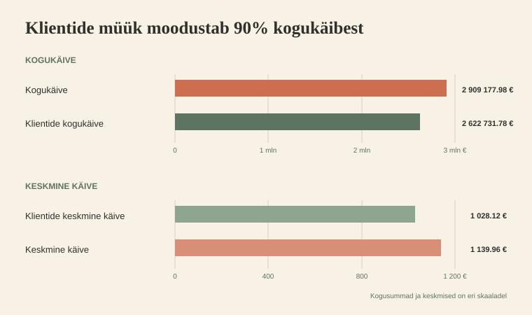

# 📊 Sales + Customers — Week 4

  <strong>Sales Analytics · Roll B – Kliendigruppide analüüs</strong>

  <a href="https://github.com/andres-assukyll/urbanstyle-sales-analytics/blob/main/week4/README.md">
    🔗 Vaata grupitööd
  </a>

---

## 🎯 Eesmärk

> Segmenteerida kliendid kulutuse järgi `VIP` / `Regular` / `Uus`.  
Leida TOP kliendid ja koostada kliendiprofiili kokkuvõte Annale.

---

# 🏆 TOP 10

---

## AI kasutamine

> *Nt kasutasin Claude'i CTE päringu debug'imiseks. AI leidis puuduva GROUP BY klausli.*

