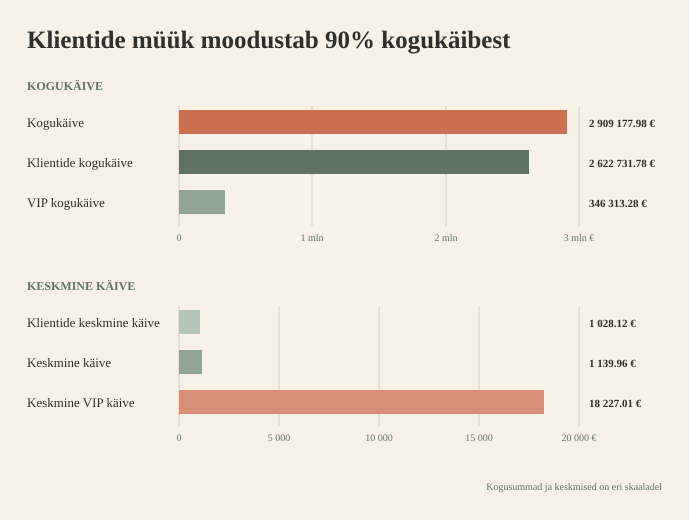
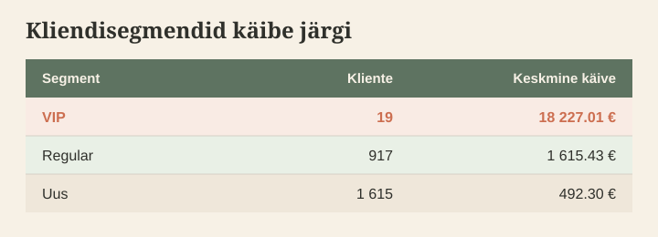
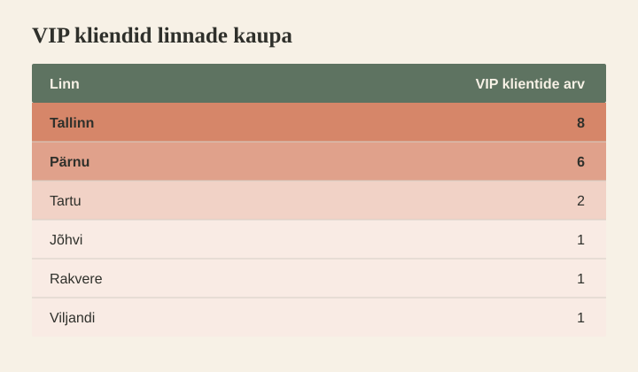
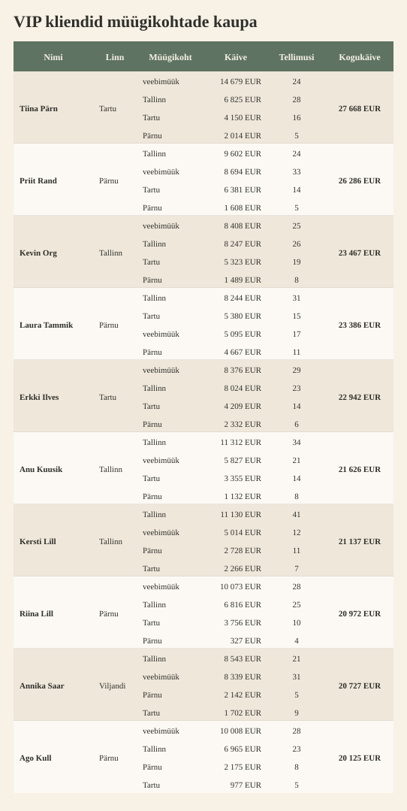

# 📊 Sales + Customers — Week 4

  <strong>Sales Analytics · Roll B – Kliendigruppide analüüs</strong>

  <a href="https://github.com/andres-assukyll/urbanstyle-sales-analytics/blob/main/week4/README.md">
    🔗 Vaata grupitööd
  </a>

---

## 🎯 Eesmärk

> Segmenteerida kliendid kulutuse järgi `VIP` · `Regular` · `Uus`.  
Leida TOP kliendid ja koostada kliendiprofiili kokkuvõte Annale.

---

# 🏆 TOP 10

### LISA

#### Segmendid klientide asukoha järgi

| linn    | vip_kliente | regular_kliente | uusi_kliente | linna_kogukäive | linna_top_klient |
| ------- | ----------- | --------------- | ------------ | --------------- | ---------------- |
| Tallinn | 8           | 358             | 641          | 1 006 253 EUR   | Kevin Org        |
| Tartu   | 2           | 190             | 333          | 523 287 EUR     | Tiina Pärn       |
| Pärnu   | 6           | 102             | 168          | 374 006 EUR     | Priit Rand       |

#### VIP-klientide lojaalsusaste

| nimi         | lojaalsusaste |
| ------------ | ------------- |
| Annika Saar  | gold          |
| Kevin Org    | gold          |
| Tiina Pärn   | gold          |
| Urmas Kask   | gold          |
| Erkki Ilves  | silver        |
| Laura Tammik | silver        |
| Merike Vaher | silver        |
| Priit Rand   | silver        |
| Ago Kull     | bronze        |
| Marika Sepp  | bronze        |
| Ago Lõoke    | puudub        |
| Ants Paju    | puudub        |
| Anu Kuusik   | puudub        |
| Kersti Lill  | puudub        |
| Pille Sepp   | puudub        |
| Priit Järv   | puudub        |
| Riina Lill   | puudub        |
| Terje Kukk   | puudub        |
| Tiina Laas   | puudub        |

---

## AI kasutamine

> *Nt kasutasin Claude'i CTE päringu debug'imiseks. AI leidis puuduva GROUP BY klausli.*

